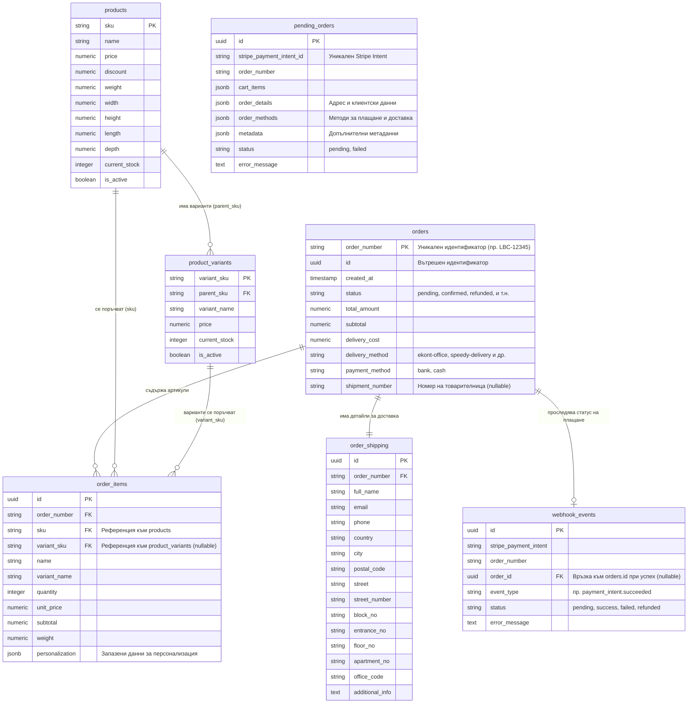

# Supabase База Данни - Схема и Взаимодействия (За Gemini)

Този документ описва структурата на съществуващата PostgreSQL база данни (Supabase) за проекта "Little Bloom Creations", включително ключовите таблици, техните полета и релациите (Foreign Keys) помежду им. Това е напълно достатъчно на Gemini, за да изгради точната Drizzle ORM схема.

## 1. Диаграма на релациите (Mermaid)

## 2. Описание на Таблиците и Взаимодействията

### Каталог (Продукти и Варианти)
* **`products`**: Основната таблица за продукти. Първичният ключ (Primary Key) е `sku` (напр. "BOX-001"). Съдържа размери, тегло, цена и налични бройки (`current_stock`).
* **`product_variants`**: Дъщерна таблица за варианти на продукта (напр. различни цветове/размери). Свързана е към `products` чрез Foreign Key `parent_sku`.

### Поръчки (Orders)
* **`orders`**: Основната таблица, пазеща метаданните за поръчката. Първичният ключ в бизнес логиката обикновено е `order_number` (генериран от системата низ). Пази статуса на поръчката, общата сума, цената за доставка и евентуално номера на реалната товарителница (`shipment_number`), след като тя бъде генерирана от куриера.
* **`order_shipping`**: Таблица с релация 1-към-1 спрямо `orders`. Съдържа всички лични данни на клиента и точния адрес/офис за доставка. Свързана е към `orders` чрез `order_number` (или `order_id`).
* **`order_items`**: Таблица с релация 1-към-Много спрямо `orders`. Всеки запис е конкретен артикул в количката на клиента. Пази `sku` и `variant_sku`, за да знаем какво точно се купува. Също така запазва JSON обект `personalization` с изисквания за гравюри/текстове, избрани от клиента.

### Плащания и Stripe (Временни състояния)
* **`pending_orders`**: Временна таблица. Когато потребителят започне плащане с карта (Stripe Checkout), тук се "паркира" цялата му количка под формата на JSON, заедно със `stripe_payment_intent_id`. Това предотвратява изгубване на данни, докато чакаме отговор от банката. След успешен Stripe Webhook, данните от тук се местят в истинските таблици (`orders`, `order_items`, `order_shipping`).
* **`webhook_events`**: Таблица за одит (Audit Log). Записва всяко събитие, получено от Stripe. Използва се и от фронтенда (чрез polling), за да разбере дали плащането е преминало в статус `success` или `failed`, и за да пренасочи клиента към страницата за успешна поръчка. Свързана е към финалната поръчка чрез `order_id` (само при успех).
