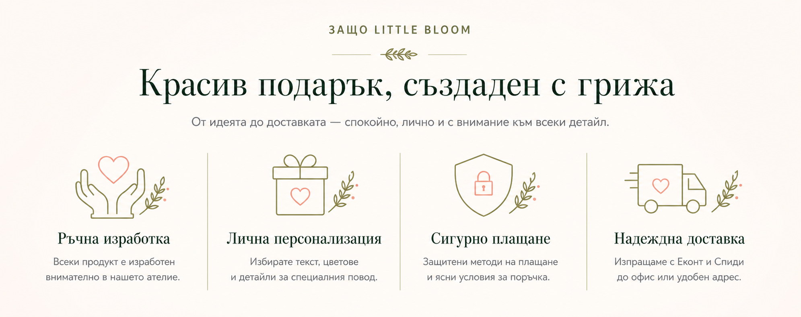

# Homepage component mockups

Тези изображения са концептуални desktop mockups за плана в
[`homepage-optimization-plan.md`](../homepage-optimization-plan.md).

Те са визуална посока, а не готови production спецификации. При
имплементация трябва да се използват реалните продуктови данни, снимки,
контакти, цени, условия за доставка и текстове от Sanity.

## Компоненти

1. [Navbar](./01-navbar.png)
2. [Hero](./02-hero.png)
3. [Trust strip](./03-trust-strip.png)
4. [Категории](./04-categories.png)
5. [Избрани продукти](./05-featured-products.png)
6. [Как се поръчва](./06-how-to-order.png)
7. [Персонализация](./07-personalization.png)
8. [За нас](./08-about-us.png)
9. [Галерия и социално доказателство](./09-gallery-social-proof.png)
10. [Отзиви](./10-testimonials.png)
11. [FAQ и доставка](./11-faq-delivery.png)
12. [Newsletter](./12-newsletter.png)
13. [Footer](./13-footer.png)
14. [Benefits section redesign](./14-benefits-section-redesign.png)
15. [Brand statement redesign](./15-brand-statement-redesign.png)

## Benefits section redesign preview

## Brand statement redesign preview

## Общи правила за имплементация

- Запазване на текущата warm-white, blush, olive и dark-green палитра.
- Максимален border radius от 8px за продуктови карти и контроли.
- Реални продуктови снимки вместо генерираните примерни продукти.
- Един и същ container width и spacing scale във всички секции.
- Българските текстове да идват от Sanity, а не да бъдат hardcoded.
- Mobile дизайнът да се проектира отделно, а не само чрез свиване на desktop.
- Само hero изображението да бъде `priority`.
- Featured products да използва реални цени и наличности от каталога.
- Newsletter да остане скрит до реална backend интеграция.
- Footer контактите и правните връзки да използват потвърдени данни.

## Бележка за AI mockups

AI генерацията може да допусне малки печатни или графични неточности.
Точният текст, иконите, spacing-ът и responsive поведението трябва да бъдат
реализирани в кода и проверени с browser screenshots.
